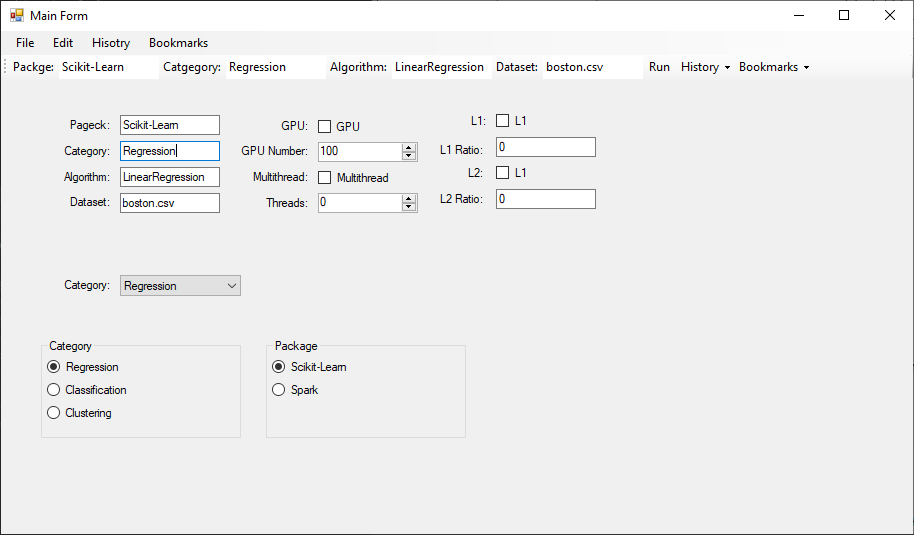
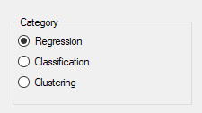
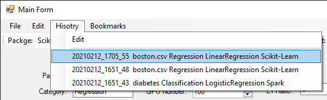

# EZFX Developer User Interface


This framework intend to provide an easy to use tool for development team develop their **internal** tool.


We call it *Developer User Interface*. It is similar to the graphics user interface but it is tailored for developers not for end users.


We use C# to develop is frontend. Because it is the most easy GUI tool for windows. It has a WYSIWYG design time. Developers can make a C# win-form GUI just by drag-and-drop.


We make it even easier by simplify the configuration to JSON. And save it to *history* or *bookmarks*.


As well as several classes to bind win-form controls to configuration.


In the example, We demonstrate that a DUI can be developed by just dozens of lines.



**EZFX** stands for Easy Framework.


## How to Use?

### Call External Process

**Call bat files**

```c#
string batContent = "cd py \n";
batContent += "python script.py \n";
batContent += "pause \n";
ExternalProcess.Bat(batContent);
```


### Configuration

We use

**Save C# configuration to JSON**

```c#
var settings = Properties.Settings.Default;
settings.Save2Json();
```

**Bind configuration to toolstrip textbox**

```c#
var settings = Properties.Settings.Default;
settings.Bind("package", packageTextBox.TextBox);
```

**Bind configuration to radio buttons**

First, in the design window, drag and drop a group box control and add three radio buttons in it.



Then bind to the category property of the settings.

```C#
settings.BindRadios(settings, "category", categoryGroupBox);
```

This binds package to 

**Bind configuration to combo-box**

In constructor:

```c#
var settings = Properties.Settings.Default;
categoryComboBox.DataSource = System.Enum.GetNames(typeof(Category));
```

In the form load event:

```c#
categoryComboBox.SelectedIndex = this.categoryComboBox.FindString(settings.category);
```

### History and Bookmarks

**Apply History and Bookmarks menus**



```c#
HistoryUI.AddMenuItems(hisotryToolStripMenuItem, 20);
BookmarkUI.AddMenuItems(bookmarkButton, 20);
```

