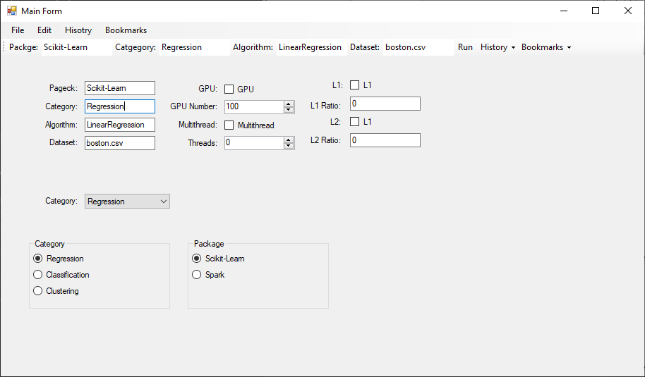
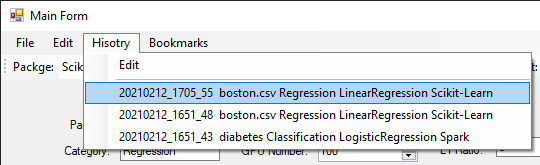
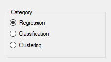

# EZFX Developer User Interface


This framework intend to provide an easy to use tool for development team develop their **internal** tool.


We call it *Developer User Interface*. It is similar to the graphics user interface but it is tailored for developers not for end users.


We use C# to develop is frontend. Because it is the most easy GUI tool for windows. It has a WYSIWYG design time. Developers can make a C# Winform GUI just by drag-and-drop.


We make it even easier by simplify the configuration to JSON. And save it to *history* or *bookmarks*.


As well as several classes to bind Winform controls to configuration.


In the example, We demonstrate that a DUI can be developed by just dozens of lines.



**EZFX** stands for Easy Framework.


## How to?

Call bat files:

```c#
string batContent = "cd py \n";
batContent += "python script.py \n";
batContent += "pause \n";
ExternalProcess.Bat(batContent);
```


Save C# configuration to JSON

```c#
var settings = Properties.Settings.Default;
settings.Save2Json();
```

Apply History and Bookmarks menus:



```c#
HistoryUI.Apply(hisotryToolStripMenuItem, 20);
BookmarkUI.Apply(bookmarkButton, 20);
```

Bind configuration to toolstrip textbox:

```c#
var settings = Properties.Settings.Default;
settings.Bind("package", packageTextBox.TextBox);
```

Bind configuration to radio buttons



```C#
RadioButtonGroupUI.Apply(settings, "package", scikitLearnRadioButton, sparkRadioButton);
```

Bind configuration to combobox:

In constructor:

```c#
var settings = Properties.Settings.Default;
categoryComboBox.DataSource = System.Enum.GetNames(typeof(Category));
```

In the form load event:

```c#
categoryComboBox.SelectedIndex = this.categoryComboBox.FindString(settings.category);
```

